# Documentación del Proyecto quantum-mpi

## Índice

1. [Visión General](#visión-general)
2. [Arquitectura del Proyecto](#arquitectura-del-proyecto)
3. [Componentes Principales](#componentes-principales)
4. [Patrones de Diseño](#patrones-de-diseño)
5. [Flujo de Ejecución](#flujo-de-ejecución)
6. [Simuladores Disponibles](#simuladores-disponibles)
7. [Comunicación entre QPUs](#comunicación-entre-qpus)
8. [CLI - Herramientas de Gestión](#cli---herramientas-de-gestión)
9. [Estructura de Directorios](#estructura-de-directorios)

---

## Visión General

Este proyecto implementa una biblioteca genérica de **Quantum MPI** en C++, diseñada para ejecutar programas cuánticos distribuidos utilizando **CUNQA** (Distributed Quantum Computing emulator for HPC) en el supercomputador cuántico **QMIO** de CESGA.

El proyecto permite:
- Construir circuitos cuánticos y exportarlos a JSON
- Orquestar ejecuciones distribuidas en múltiples QPUs virtuales (vQPUs)
- Simular comunicaciones clásicas y cuánticas entre QPUs
- Soportar múltiples backends de simulación (Qulacs, Qiskit Aer, MQT-DDSIM, etc.)

---

## Arquitectura del Proyecto

### Diagrama de Componentes de Alto Nivel

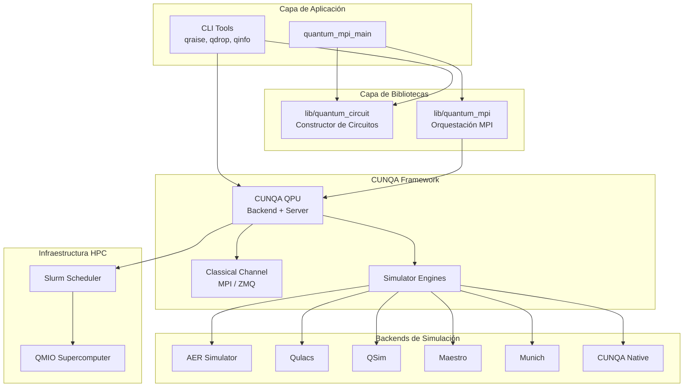

---

## Componentes Principales

### 1. Bibliotecas Base

#### lib/quantum_circuit

Biblioteca para construir circuitos cuánticos y exportarlos a JSON.

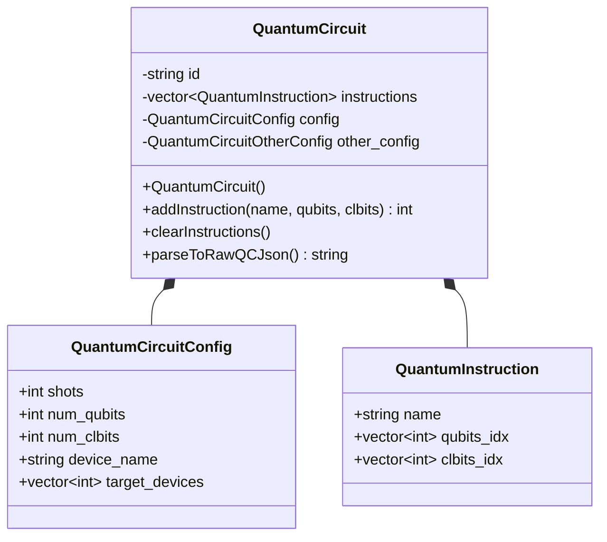

#### lib/quantum_mpi

Capa de orquestación que abstrae la ejecución MPI cuántica.

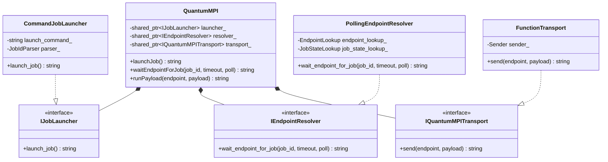

### 2. CUNQA Framework

#### QPU (Quantum Processing Unit)

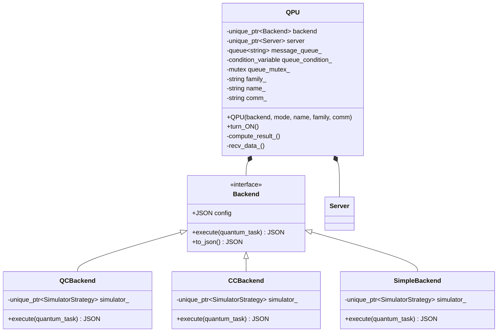

#### Backends de Simulación (Strategy Pattern)

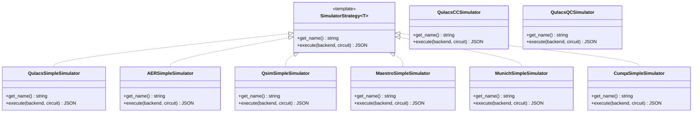

---

## Patrones de Diseño

### 1. Strategy Pattern (Simuladores)

Los simuladores implementan el patrón Strategy para permitir diferentes motores de simulación:

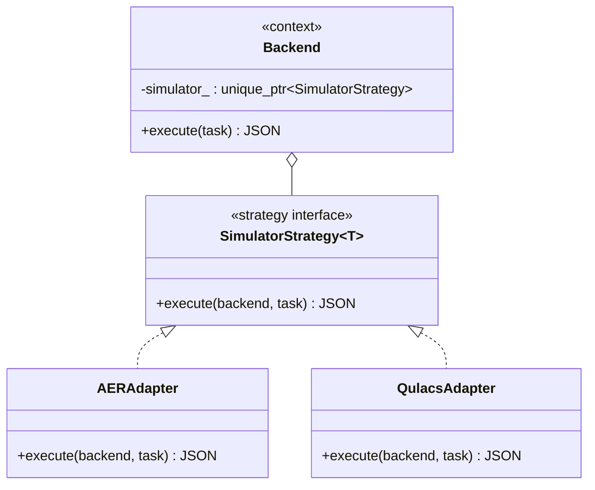

### 2. Factory Pattern (Configuraciones)

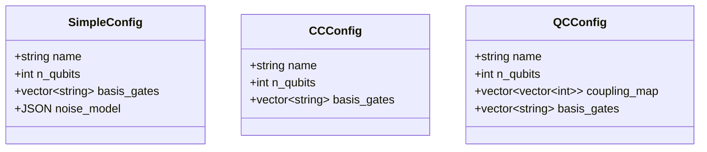

### 3. Pimpl (Pointer to Implementation)

Para ocultar la implementación y reducir dependencias:

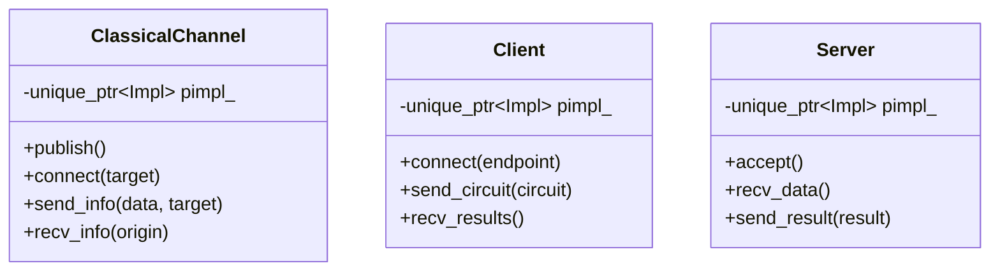

---

## Flujo de Ejecución

### Ejecución en QMIO

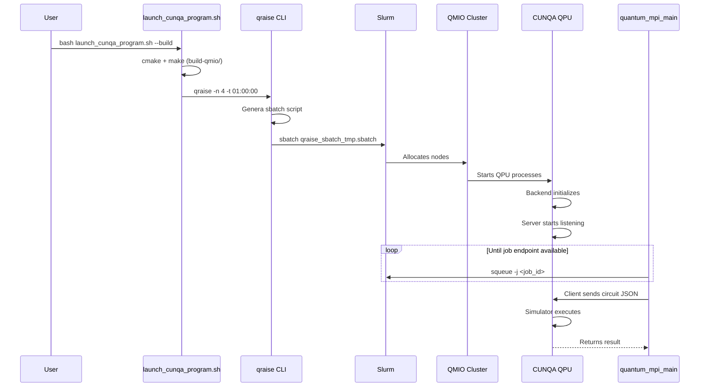

### Flujo de Tareas Cuánticas

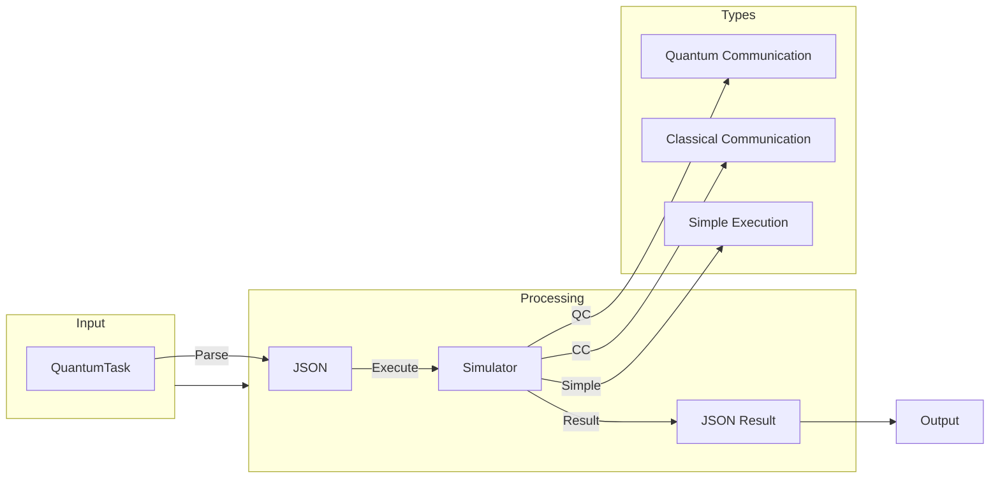

---

## Simuladores Disponibles

| Simulador | Descripción | Soporte QC | Soporte CC |
|-----------|-------------|-------------|------------|
| **Aer** | Qiskit Aer (con GPU) | Sí | Sí |
| **Qulacs** | Simulador de alto rendimiento | Sí | Sí |
| **QSim** | MQT-DDSIM | Sí | Sí |
| **Maestro** | Simulador especializado | Sí | Sí |
| **Munich** | Simulador Múnich | Sí | Sí |
| **CUNQA** | Nativo de CUNQA | Sí | Sí |

### Arquitectura de Adaptadores

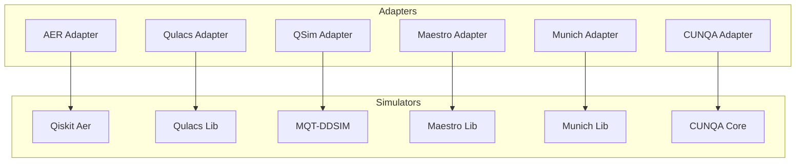

---

## Comunicación entre QPUs

### Canales de Comunicación

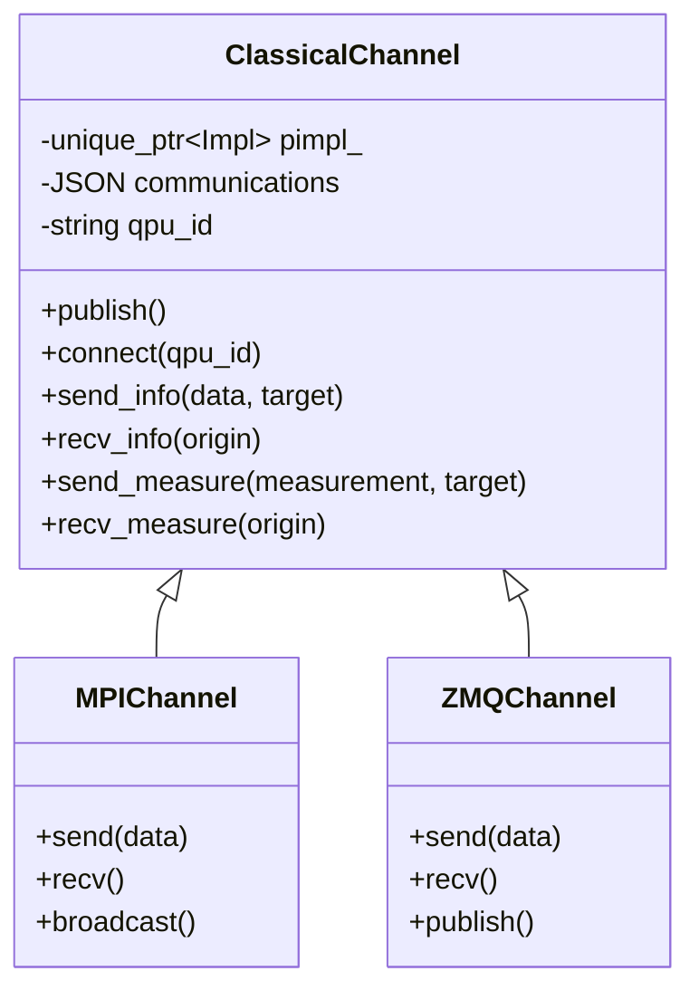

### Topologías de Comunicación

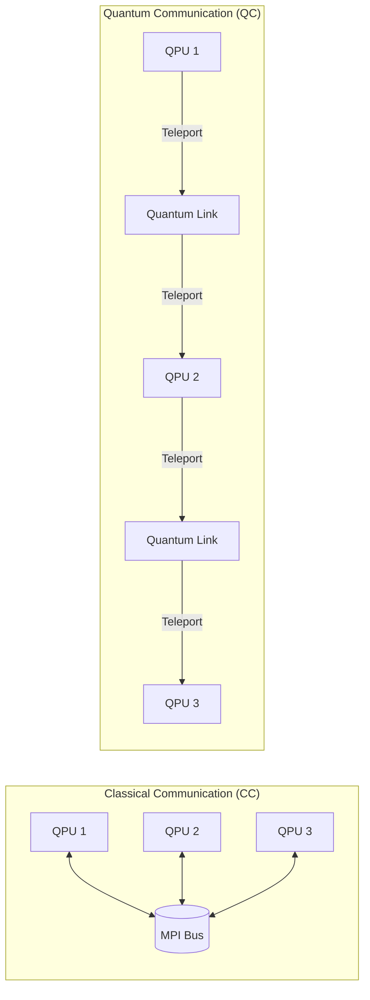

---

## CLI - Herramientas de Gestión

### Comandos Disponibles

| Comando | Descripción |
|---------|-------------|
| `qraise` | Despliega vQPUs en el cluster |
| `qdrop` | Libera recursos de vQPUs |
| `qinfo` | Muestra información de QPUs |
| `erase_key` | Elimina claves de configuración |

### Diagrama de Opciones de qraise

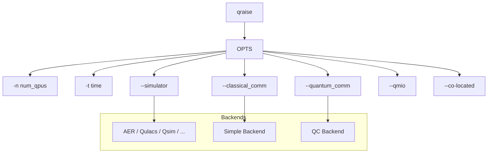

---

## Estructura de Directorios

```
quantum-mpi/
├── CMakeLists.txt           # Build principal
├── README.md
├── launch_cunqa_program.sh  # Script de lanzamiento
│
├── lib/
│   ├── quantum_circuit/     # Biblioteca de circuitos
│   │   ├── include/
│   │   │   └── quantum_circuit.hpp
│   │   ├── src/
│   │   │   └── quantum_circuit.cpp
│   │   └── tests/
│   │
│   └── quantum_mpi/          # Biblioteca MPI cuántica
│       ├── include/
│       │   └── quantum_mpi.hpp
│       ├── src/
│       │   ├── quantum_mpi.cpp
│       │   └── quantum_mpi_comm.cpp
│       └── tests/
│
├── src/
│   └── main.cpp              # Ejecutable principal
│
└── cunqa/                    # Framework CUNQA (submódulo)
    ├── CMakeLists.txt
    ├── README.md
    │
    ├── cunqa/                # Bindings Python
    │   ├── bindings.cpp
    │   ├── circuit/
    │   ├── qiskit_deps/
    │   ├── real_qpus/
    │   └── utils/
    │
    └── src/
        ├── backends/         # Backends de simulación
        │   ├── backend.hpp
        │   ├── qc_backend.hpp
        │   ├── cc_backend.hpp
        │   ├── simple_backend.hpp
        │   └── simulators/
        │       ├── simulator_strategy.hpp
        │       ├── AER/
        │       ├── Qulacs/
        │       ├── Qsim/
        │       ├── Maestro/
        │       ├── Munich/
        │       └── CUNQA/
        │
        ├── cli/              # Herramientas CLI
        │   ├── CMakeLists.txt
        │   ├── qraise.cpp
        │   ├── qdrop.cpp
        │   ├── qinfo.cpp
        │   ├── erase_key.cpp
        │   └── qraise/
        │       ├── args_qraise.hpp
        │       ├── simple_conf_qraise.hpp
        │       ├── cc_conf_qraise.hpp
        │       ├── qc_conf_qraise.hpp
        │       ├── noise_model_conf_qraise.hpp
        │       ├── qmio_conf_qraise.hpp
        │       ├── infrastructure_conf_qraise.hpp
        │       └── utils_qraise.hpp
        │
        ├── comm/             # Comunicación
        │   ├── client.hpp
        │   ├── server.hpp
        │   └── comm_impl/
        │       ├── asio/
        │       ├── crow/
        │       └── zmq/
        │
        ├── classical_channel/  # Canal clásico
        │   ├── classical_channel.hpp
        │   └── classical_channel_impl/
        │       ├── mpi/
        │       └── zmq/
        │
        ├── utils/            # Utilidades
        │   ├── json.hpp
        │   ├── logger/
        │   ├── probabilities/
        │   └── helpers/
        │
        ├── quantum_task.hpp
        └── qpu.hpp
```

### Diagrama de Dependencias de Módulos

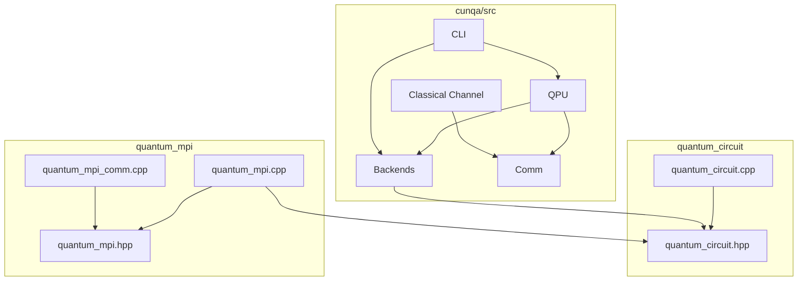

---

## Configuración y Compilación

### Compilación Local (Desarrollo)

```bash
cmake -S . -B build
cmake --build build --parallel $(nproc)
ctest --test-dir build --output-on-failure
```

### Compilación con CUNQA (QMIO)

```bash
cd cunqa
cmake -B build/ -DCMAKE_PREFIX_INSTALL=.
cmake --build build/ --parallel $(nproc)
```

### Compilación con GPU

```bash
cmake -B build/ -DCMAKE_PREFIX_INSTALL=. -DAER_GPU=TRUE
```

---

## Ejemplo de Uso

```python
# Desplegar vQPUs
from cunqa.qpu import qraise, get_QPUs

family = qraise(2, "00:10:00", simulator="Aer", co_located=True)
qpus = get_QPUs(co_located=True)

# Crear y ejecutar circuito
from cunqa.circuit import CunqaCircuit

qc = CunqaCircuit(num_qubits=2)
qc.h(0)
qc.cx(0, 1)
qc.measure_all()

# Ejecutar
from cunqa.qpu import run
from cunqa.qjob import gather

qcs = [qc] * 2
qjobs = run(qcs, qpus, shots=1000)
results = gather(qjobs)

# Liberar recursos
from cunqa.qpu import qdrop
qdrop(family)
```
